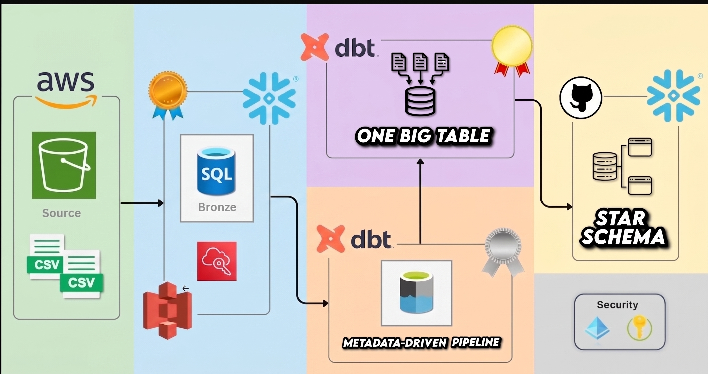
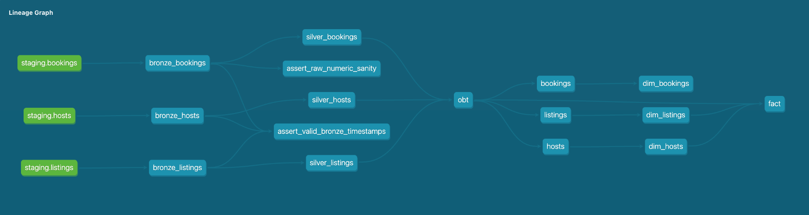
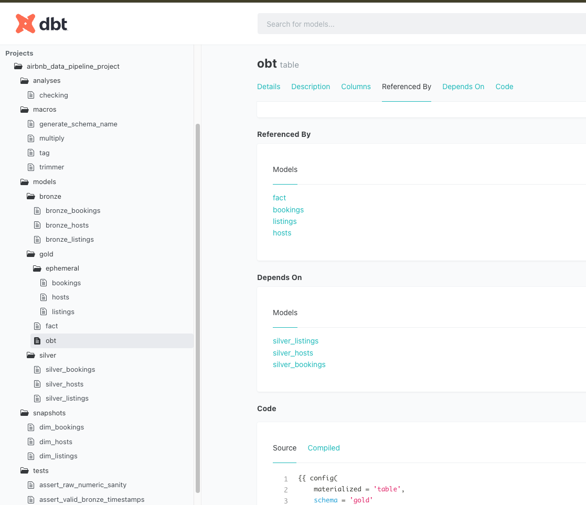
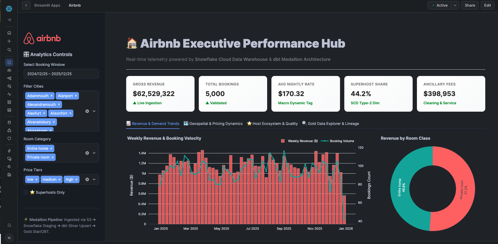

# <span style="font-size:2.2em; font-weight:800;">Airbnb-Snowflake-DBT-Data-Pipeline</span>

### 🏠 Airbnb Cloud Data Platform: End-to-End Medallion Pipeline & BI

An enterprise-grade ELT data pipeline and analytics platform built with **AWS S3**, **Snowflake**, **dbt Core**, and **Streamlit in Snowflake**.

The architecture standardizes and transforms raw transactional Airbnb data into governed analytics models using a multi-layer **Medallion architecture**, Jinja meta-programming, Slowly Changing Dimensions (SCD Type-2), automated testing guardrails, and executive BI dashboards.

---

## 🏗️ Architecture & Data Flow



---

## 🔄 Transformation Lineage (DAG)

The entire transformation pipeline is connected via native dbt `source()` and `ref()` macros, maintaining an unbroken dependency graph with data quality validation assertions embedded directly into the pipeline run.



---

## 📚 dbt Project Structure & Model Governance

The repository separates analytical models, custom macros, ephemeral CTEs, snapshots, and singular data quality tests into a modular directory hierarchy.



---

## 📊 Executive Analytics & BI Dashboard

A native **Streamlit in Snowflake** dashboard delivers real-time business telemetry directly from `AIRBNB.GOLD.OBT`, featuring:

- Dynamic multi-variable filtering
- Revenue velocity curves
- Room-class contribution analysis
- Superhost pricing metrics



---

## 🛠️ End-to-End Implementation Walkthrough

### 1. Data Lake Landing & Staging (`AIRBNB.STAGING`)

- **Source Files**: Raw CSV files (`bookings.csv`, `listings.csv`, `hosts.csv`) hosted on AWS S3.
- **Snowflake Staging**: Tables are created and data is loaded from S3 using DDL + `COPY INTO` commands defined in the `DDL/` folder.

#### ---> Table Definitions (`DDL/ddl.sql`)

#### ---> File Format, Stage & Load (`DDL/resources.sql`)

### 2. Bronze Ingestion Layer (`AIRBNB.BRONZE`)

- **Pattern**: Incremental append-only ingestion.
- **Logic**: Utilizes `is_incremental()` macros to query newly arrived records in staging based on ingestion timestamps, avoiding costly full-table recomputations.
- **Models**: `bronze_bookings.sql`, `bronze_listings.sql`, `bronze_hosts.sql`.

### 3. Silver Standardization & Transformation (`AIRBNB.SILVER`)

- **Pattern**: SCD Type-1 Upserts (incremental strategy with `unique_key`).
- **Jinja Macros & Modularity**:
  - `generate_schema_name.sql` — Dynamic schema override to eliminate unwanted default prefixes in production.
  - `tag.sql` — Classifies listing prices dynamically into discrete macro-tiers (`low`, `medium`, `high`).
  - `multiply.sql` — Standardizes financial calculations, margins, and service fees.
  - `trimmer.sql` — Cleans whitespace, null literals, and malformed strings.
- **Models**: `silver_bookings.sql`, `silver_listings.sql`, `silver_hosts.sql`.

### 4. Gold Analytics & Modeling (`AIRBNB.GOLD`)

- **Dynamic One Big Table (`gold_obt.sql`)**: Uses Jinja array-loop meta-programming to dynamically compile complex multi-table joins without hardcoded SQL redundancies.
- **Star Schema Fact (`fact.sql`)**: Distills core KPIs, transaction amounts, cleaning fees, and dimensional foreign keys.
- **SCD Type-2 Snapshots (`snapshots/`)**: Ephemeral intermediate models (`models/gold/ephemeral/`) pass clean records to dbt snapshot engines (`dim_bookings`, `dim_listings`, `dim_hosts`) to capture historical changes using `dbt_valid_from` and `dbt_valid_to` timestamps.

### 5. Automated Data Quality Guardrails (`tests/`)

- **Schema Tests**: Built-in validation checking `unique`, `not_null`, and referential integrity across all entities.
- **Singular Reconciliation Assertions**:
  - `assert_all_staging_bookings_in_bronze.sql` — Verifies zero record drop-off between staging and bronze.
  - `assert_staging_bronze_row_count_match.sql` — Reconciles row-count parity across layers.
  - `assert_valid_bronze_timestamps.sql` — Catches malformed or future-dated records.
  - `assert_raw_numeric_sanity.sql` — Blocks negative financial values from propagating downstream.

### 6. Interactive BI Layer (Streamlit in Snowflake)

- Real-time querying directly from `AIRBNB.GOLD.OBT` using the native Snowpark session.
- Interactive sidebar controls for date windows, city multi-selection, and superhost status.
- Built-in KPI metrics, revenue trajectory area charts, room-class revenue share donuts, and a searchable tabular data explorer.

---

## 📁 Repository Directory Structure

```text
.
├── .gitignore
├── pyproject.toml
├── README.md
├── assets/
│   ├── architecture.jpeg
│   ├── dbt_doc_overview.png
│   ├── dbt_lineage_graph.png
│   └── streamlit_host_market_view.png
├── DDL/
│   ├── ddl.sql
│   └── resources.sql
├── src/
│   └── airbnb_data_pipeline/
│       └── streamlit_app.py
└── airbnb_data_pipeline_project/
    ├── dbt_project.yml
    ├── macros/
    │   ├── generate_schema_name.sql
    │   ├── multiply.sql
    │   ├── tag.sql
    │   └── trimmer.sql
    ├── models/
    │   ├── sources/
    │   │   └── sources.yml
    │   ├── bronze/
    │   │   ├── schema.yml
    │   │   ├── bronze_bookings.sql
    │   │   ├── bronze_hosts.sql
    │   │   └── bronze_listings.sql
    │   ├── silver/
    │   │   ├── silver_bookings.sql
    │   │   ├── silver_hosts.sql
    │   │   └── silver_listings.sql
    │   └── gold/
    │       ├── obt.sql
    │       ├── fact.sql
    │       └── ephemeral/
    │           ├── bookings.sql
    │           ├── hosts.sql
    │           └── listings.sql
    ├── snapshots/
    │   ├── dim_bookings.yml
    │   ├── dim_hosts.yml
    │   └── dim_listings.yml
    └── tests/
        ├── assert_all_staging_bookings_in_bronze.sql
        ├── assert_raw_numeric_sanity.sql
        ├── assert_staging_bronze_row_count_match.sql
        └── assert_valid_bronze_timestamps.sql
```

---

## 🚀 Quickstart & Execution

### 1. Environment Setup

```bash
# Clone the repository
git clone https://github.com/saiharsha-14/Airbnb-Snowflake-DBT-Data-Pipeline.git
cd Airbnb-Snowflake-DBT-Data-Pipeline

# Install Python dependencies using uv or pip
uv sync
# or
pip install -r requirements.txt
```

### 2. Configure Snowflake Profile

Create or update `~/.dbt/profiles.yml`:

```yaml
airbnb_data_pipeline_project:
  target: dev
  outputs:
    dev:
      type: snowflake
      account: <YOUR_SNOWFLAKE_LOCATOR>
      user: <YOUR_SNOWFLAKE_USER>
      password: <YOUR_SNOWFLAKE_PASSWORD>
      role: ACCOUNTADMIN
      database: AIRBNB
      warehouse: COMPUTE_WH
      schema: PUBLIC
      threads: 4
```

### 3. Run dbt Pipeline & Tests

```bash
cd airbnb_data_pipeline_project

# Validate dependencies and compilation
dbt deps
dbt compile

# Execute complete pipeline and snapshots
dbt build

# Run quality assertions
dbt test

# Launch documentation server to inspect DAG
dbt docs generate && dbt docs serve
```

### 4. Run Streamlit Dashboard

**Inside Snowflake**  
Navigate to **Projects → Streamlit**, select the `AIRBNB.GOLD` schema and `COMPUTE_WH` warehouse, paste the contents of `src/airbnb_data_pipeline/streamlit_app.py`, and run.

---

## 📄 License

This project is open source. Feel free to use, modify, and distribute it.
